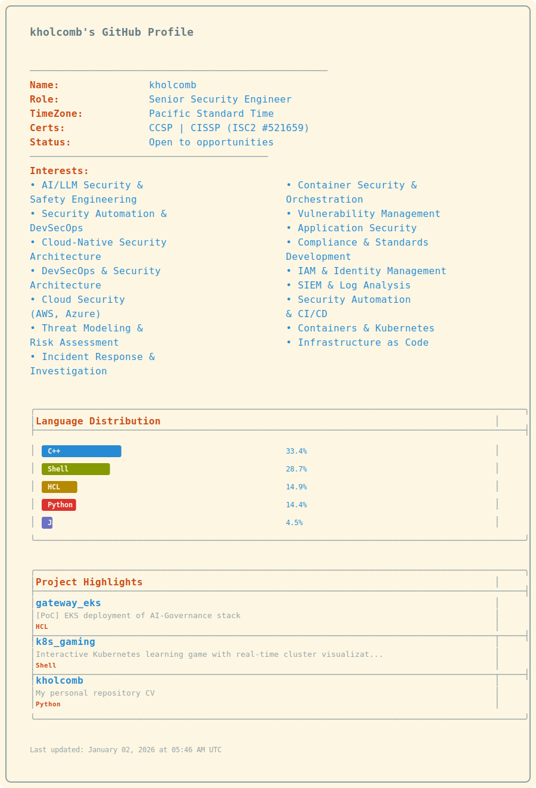

<picture>
  <source media="(prefers-color-scheme: dark)" srcset="dark_mode.svg">
  <source media="(prefers-color-scheme: light)" srcset="light_mode.svg">
  
</picture>

---

### Connect

---

  Last updated: <i>Automatically via GitHub Actions</i> • Built with <a href="https://github.com/kholcomb/kholcomb/blob/main/today.py">Python</a>

